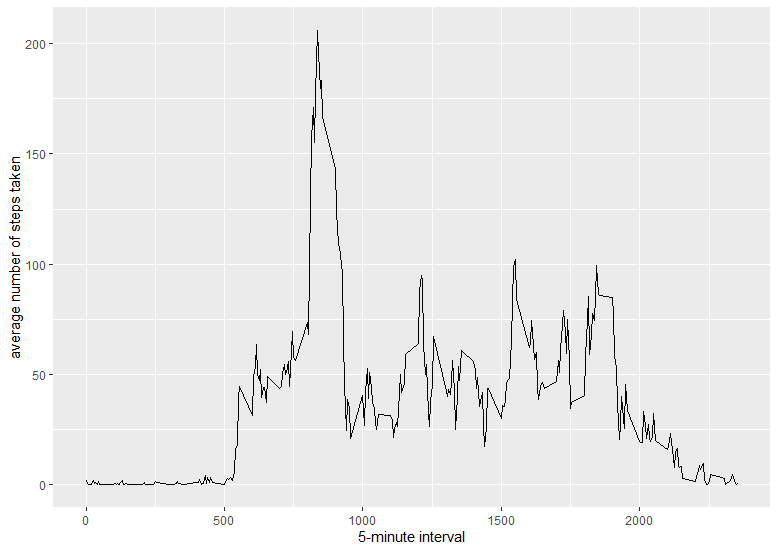

# Reproducible Research---Project 1

```{r, echo=FALSE, results='hide', warning=FALSE, message=FALSE}
library(ggplot2)
```

## Loading and preprocessing the data
##### 1. Load the data (i.e. read.csv())
```{r, results='markup', warning=TRUE, message=TRUE}
if(!file.exists('activity.csv')){
    unzip('activity.zip')
}
activity <- read.csv('activity.csv')
```

## What is mean total number of steps taken per day?
```{r}
step_day <- tapply(activity$steps, activity$date, sum, na.rm=TRUE)
```

##### 1. Make a histogram of the total number of steps taken each day
```{r}
qplot(step_day, xlab='Total steps per day', ylab='Frequency using binwith 500', binwidth=500)
```
 

##### 2. Calculate and report the mean and median total number of steps taken per day
```{r}
step_day_mean <- mean(step_day)
step_day_median <- median(step_day)
```

* Mean: 9354.2295
* Median:  10395

## What is the average daily activity pattern?
```{r}
average_step_time <- aggregate(x=list(mean_steps=activity$steps), by=list(interval=activity$interval), FUN=mean, na.rm=TRUE)
```

##### 1. Make a time series plot
```{r}
ggplot(data=average_step_time, aes(x=interval, y=mean_steps)) +
  geom_line() +
  xlab("5-minute interval") +
  ylab("average number of steps taken") 
```

 

##### 2. Which 5-minute interval, on average across all the days in the dataset, contains the maximum number of steps?
```{r}
most_steps <- which.max(average_step_time$mean_steps)
most_steps_time <-  gsub("([0-9]{1,2})([0-9]{2})", "\\1:\\2", average_step_time[most_steps,'interval'])
```

* Most Steps at: 8:35

## Imputing missing values
##### 1. Calculate and report the total number of missing values in the dataset 
```{r}
num_missing <- length(which(is.na(activity$steps)))
```

* Number of missing values: 2304

##### 2. Devise a strategy for filling in all of the missing values in the dataset.
##### 3. Create a new dataset that is equal to the original dataset but with the missing data filled in.
```{r}
activity_imputed <- activity
activity_imputed$steps[is.na(activity_imputed$steps)] = mean(activity_imputed$steps, na.rm=TRUE)
```


##### 4. Make a histogram of the total number of steps taken each day 
```{r}
step_day_imputed <- tapply(activity_imputed$steps, activity_imputed$date, sum)
qplot(step_day_imputed, xlab='Total steps per day (Imputed)', ylab='Frequency using binwith 500', binwidth=500)
```
 

##### ... and Calculate and report the mean and median total number of steps taken per day. 
```{r}
step_day_imputed_mean <- mean(step_day_imputed)
step_day_imputed_median <- median(step_day_imputed)
```
* Mean (Imputed): 1.0766 &times; 10<sup>4</sup>
* Median (Imputed):  1.0766 &times; 10<sup>4</sup>


## Are there differences in activity patterns between weekdays and weekends?
##### 1. Create a new factor variable in the dataset with two levels – “weekday” and “weekend” indicating whether a given date is a weekday or weekend day.

```{r}
activity_imputed$date_type <-  ifelse(as.POSIXlt(activity_imputed$date)$wday %in% c(0,6), 'weekend', 'weekday')
```

##### 2. Make a panel plot containing a time series plot

```{r}
activity_imputed_agg <- aggregate(steps ~ interval + date_type, data=activity_imputed, mean)
ggplot(activity_imputed_agg, aes(interval, steps)) + 
  geom_line() + 
  facet_grid(date_type ~ .) +
  xlab("5-minute interval") + 
  ylab("avarage number of steps")
```

  
